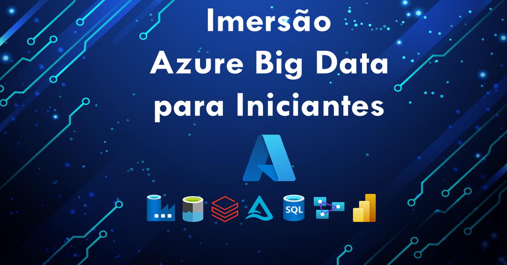

# Imersao-Azure-Big-Data

  

Treinamento Azure Data Factory + Azure Databricks + Azure Analysis Services + Power BI realizado em janeiro de 2022 com o objetivo de abordar técnicas para ingestão e tratamento de dados utilizando a suíte Azure. O treinamento foi ministrado por: 

- <a href="https://www.linkedin.com/in/luizfsantana/" target="_blank">Luiz Santana</a>   
- <a href="https://www.linkedin.com/in/fabiofsantos/" target="_blank"> Fábio Santos</a> 
- <a href="https://www.linkedin.com/in/matheusandradeg/" target="_blank"> Matheus Andrade</a> 

## Conteúdos Azure Data Factory

<ol>
  <li> Apresentação do Azure Data Factory (ADF)</li>
  <li> Conceitos de ETL X ELT</li>
  <li> Conceitos de Spark</li>
  <li> Provisionamento dos serviços da Azure
    <ul>
      <li> Data Factory </li>
      <li> Data Lake</li>
      <li> Key Vault</li>
      <li> Azure SQL Database</li>
    </ul>
  </li>
  <li> Configuração do ADF
    <ul>
      <li> Integration Runtime</li>    
      <li> Integration Runtime Self-Hosted</li>  
      <li> Linked Services</li>  
      <li> Datasets</li>    
    </ul>   
  </li>
  <li> Integrações
    <ul>
      <li> Azure Key Vault</li>
      <li> GitHub</li>
    </ul>
  </li>
  
  <li> Activities
    <ul>
      <li> Conhecendo as Activities</li>
      <li> Praticando as Activities</li>
    </ul>
  </li>
  
  <li> Data Flow
    <ul>
      <li> Conhecendo o Data Flow</li>
      <li> Praticando o Data Flow</li>
    </ul>
  </li>
</ol>

## Conteúdos Azure Databricks

<ol>
  <li> Conceitos do Azure Databricks</li>
  <li> Conceitos do Apache Spark
    <ul>
          <li> Data Frame</li>
          <li> Aprendizado de máquina</li>
    </ul>
  </li>
  
  
  <li> Conhecendo a plataforma do Databricks</li>
  <li> Conceitos de Python
    <ul>
      <li> Listas</li>
      <li> Função</li>
    </ul>
  </li>
  
  <li> Provisionando Azure Databricks</li>
  <li> Integrações do Databricks
    <ul>
      <li> Key Vault</li>
      <li> Data Factory</li>
      <li> Data Lake</li> 
    </ul>
  
  </li>
  <li> Conceitos de Delta Lake</li>
  <li> Aplicabilidade Python x SQL X Delta</li>
  <li> Notebooks
    <ul>
        <li> Criando conexão com o Data Lake</li>
        <li> Lendo arquivo da camada Raw</li>
        <li> Ajustando o dado e escrevendo arquivo na camada Trusted</li>
        <li> Agregando valor ao dado e escrevendo na Refined</li>
        <li> Criando conexão com o SQL DB</li>
        <li> Escrevendo no SQL DB</li>   
    </ul>
  
  </li>
 
  
</ol>

## Conteúdos Azure Analysis Services

<ol>
    <li> Entendendo o processo de tomada de decisão com o BI</li>
    <li> A necessidade de um modelo semântico</li>
    <li> Conceitos ETL x ELT</li>
    <li> O que é o Analysis Services ?</li>
    <li> Onde o Analysis Services se encaixa num projeto de BI ?</li>
    <li> Porque utilizar o Analysis Services ? Quando utilizar ?</li>
    <li> Precificação do Analysis Services</li>
    <li> Laboratório Analysis Services:
      <ul>
        <li> MS Visual Studio</li>
        <li> SQL Server Management Studio</li>
        <li> Fontes de dados</li>
        <li> Power Query (Linguagem M)</li>
        <li> Modelagem</li>
        <li> DAX</li>
        <li> Colunas Calculadas</li>
        <li> Medidas</li>
        <li> Segurança (Row Level Security)</li>
        <li> Processamento</li>
        <li> Particionamento</li>
        <li> Boas Práticas</li>
        <li> Deploy</li>
      </ul>
  
  
  </li>
  
 </ol>

## Power BI

<ol>
    <li> Entendendo a necessidade da visualização e compartilhamento dos dados</li>
    <li> O que é o Power BI ?</li>
    <li> Fontes de Dados</li>
    <li> Tipos de Conexão</li>
    <li> Power BI Desktop</li>
    <li> Power BI Service</li>
    <li> Power BI Mobile</li>
    <li> Modelagem</li>
    <li> Compartilhamento (Apps, Dashboards, Reports)</li>
    <li> Licenciamento do Power BI (planos e capacidades)</li>
    <li> Laboratório Power BI:
      <ul>  
        <li> Ingestão</li>
        <li> Power Query (Linguagem M)</li>
        <li> DAX</li>
        <li> Analysis Services</li>
        <li> Gráficos</li>
        <li> Compartilhamento</li>
        <li> Workspaces</li>
        <li> Conjunto de dados</li>
        <li> Fluxo de Dados</li>
        <li> On Premises Data Gateway</li>
        <li> Atualização Agendada</li>
        <li> Alertas</li>
        <li> Assinaturas</li>  
      </ul> 
    </li>
    
  
</ol>

